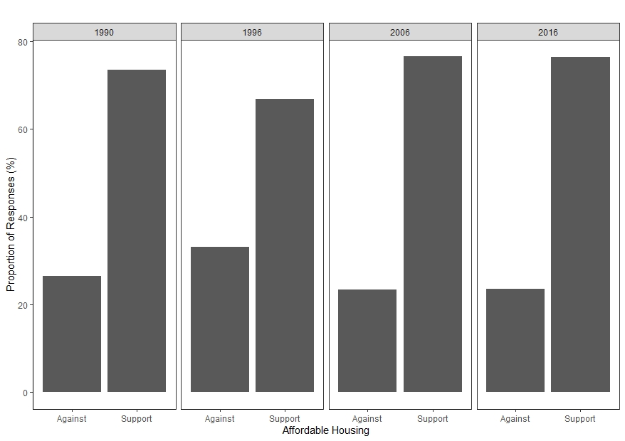
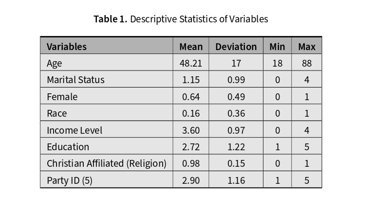
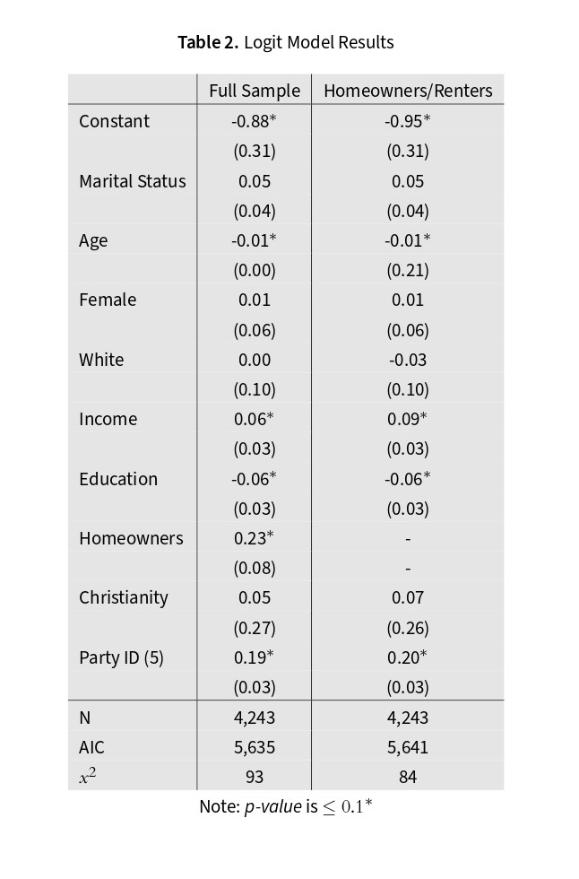
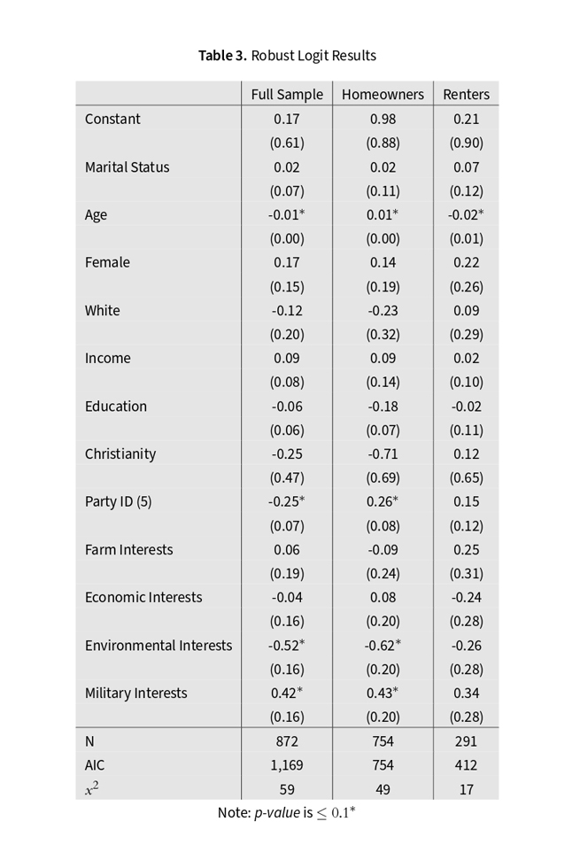

------------------------------------------------------------------------

------------------------------------------------------------------------

# POLS-913

The contents of this repository are as follows:

`Codebook` variables from research and how they are operationalized

`Data` is the finalized GSS data that was used to conduct the analysis

`Final` only has the first available page of the research along with the abstract

`LaTeX Code` has most of the code that was used to write the paper

`Project Code` Rscript files of the code that was uses for the research

`Tables_Figures` contains all the models, figures, and tables

### Overview

This quantitative research was for a Urban Politics (American) graduate course. It focuses on the Not-In-My-Backyard (NIMBY) movement in the United States. Previous research has shown that the NIMBY movement is the core opposition towards affordable housing development in the United States and other countries. Rather than following the traditional path of NIMBY research, this paper argues that there is more to the typical opposition than just within the realm of affordable housing policy. This is done by using a survey research design with the General Social Survey (GSS) as this also tests other for local public policies along with NIMBY attitudes towards affordable housing.

### Results

There were only a couple of significant variables including party identity, military policy interests, and environmental policy interests. Age is significant but the levels are very low not signifying much of any information. These results demonstrating that NIMBY and anti-government funding attitudes are prevalent among different determinants. First, is party identification displayed more Republican identifying response among NIMBY/ Anti-funding attitudes. There are different national policy interests compared enviromental and millitary. NIMBY/anti-government attitudes were not very interested in enviromental issues. 

National policy interests were included as control variables within the analysis. The goal of this was to see if there was a difference between support among local policies with the NIMBY attitudes (dependent variable) that call for some type of survey question phrasing that eludes to government funding compared to national policy interests (military, environmental, economic) which does not include such wording.

### Issues

Overall, this was a term paper clearly not free from errors and other outstanding issues. First, is all of the models violate all of the OLS assumptions. This is still evident when swamping the outcome variable. However, since the outcome variable for this research is constructed of multiple other survey questions and transformed into a dichotomous variable this could explain some of the issues. Second, the models only tested the transformed variables without consideration of holding anything constant such as the means. Logit models at times are difficult to intrepret using a thermometer scale from 0-100 could have improve the findings. As using the form of scale would help interpretation and robustness checks. However, even the available robust checks for final models when working with a binary variable still did not check out either. Finally, some of the transformed variables do not make sense in the final models (i.e. did I mention this was a term paper? :D) such as marriage which an increase in the coefficient does not convey much information.

### References

[Cambridge Small Template - LaTeX](https://www.overleaf.com/latex/templates/cambridge-small-template-class-file/tcfpmdpjdybn)
